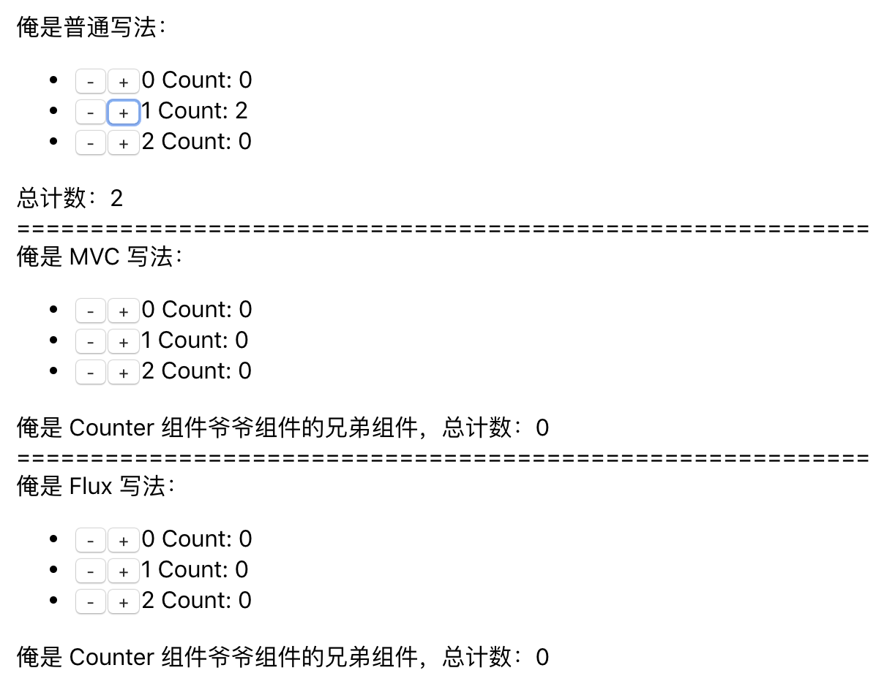

# flux-redux-demo

注：此文根据某篇网上文章 / github 代码仓库精简（找不到原文了）。

## 大纲
用 React 实现一个三行计数器的四种写法



* 普通 写法
* MVC 写法
* Flux 写法
* Redux 写法

过程中分析各自对应的问题，以此梳理 MVC、Flux、Redux 脉络，便于理解。

## 普通写法

详见：[0.normal](./src/0.normal/)

```js
// counter
export default class extends React.Component {
  render() {
    return <li>
      <button onClick={() => this.props.onCounterUpdate('minus')}>-</button>
      <button onClick={() => this.props.onCounterUpdate('plus')}>+</button>
      {this.props.caption} Count: {this.props.value}
    </li>
  }
}

// controlpanel
export default class ControlPanel extends React.Component {
  state = {
    nums: [0, 0, 0],
  }
  onCounterUpdate = (type, index) => {
    const { nums } = this.state
    const newNums = [...nums]
    if (type === 'minus') {
      if (nums[index] > 0) {
        newNums[index] = newNums[index] - 1
      }
    } else {
      newNums[index] = newNums[index] + 1
    }

    this.setState({ nums: newNums })
  }
  render() {
    const { nums } = this.state
    return (
      <div>
        俺是普通写法：
        <ul>
          {
            nums.map((num, index) => {
              return <Counter value={num} caption={index} key={index} onCounterUpdate={(type) => this.onCounterUpdate(type, index)} />
            })
          }
        </ul>
        总计数：{nums.reduce((memo, n) => memo + n, 0)}
      </div>
    )
  }
}
```

可以看出，如果仅针对这样的计数组件，这么写其实很完美。

但是，

1. 如果其他地方（例如同级别组件，父级组件的父级组件的兄弟组件）也需要这部分 `nums`，也需要变动这个 `nums` 数据怎么办？
2. 基于问题一，只能层层嵌套，把这部分数据，一层层放到更上层 / 更更上层 / 更更更上层 ... 管理，然后一层层 **props down events up**
3. 问题二的场景，应该属于最大的问题，单身又一个人玩嘛，累就累点，关键以后维护就会比较难了，特别是更多的组件依赖这个 `nums` 数据的时候

然后想到了用 MVC / pubsub 来做，把数据放到单独的地方维护，每次数据更新通过 pubsub 形式，监听到数据变化，再 set 到组件内，进行 View 层渲染

## MVC 写法

详见：[1.mvc](./src/1.mvc/)

```js
// model
export default [0, 0, 0]

// controller
import nums from './model'
const eventStack = {}
const pubsub = {
  on(key, handler) {
    eventStack[key] = handler
  },
  emit(key) {
    eventStack[key](nums[key])
  }
}
export default {
  listen(...params) {
    pubsub.on(...params)
  },
  update(index, count) {
    nums[index] = count
    pubsub.emit(index)
    pubsub.emit('all')
  },
  getNum(index) {
    return nums[index]
  },
  getNums() {
    return nums
  }
}

// counter
export default class extends React.Component {
  constructor(props) {
    super(props)
    this.state = {
      num: this.getNum()
    }
  }
  onCounterUpdate = (type) => {
    const { num } = this.state
    if (type === 'minus') {
      if (num > 0) {
        controller.update(this.props.caption, num - 1)
      }
    } else {
      controller.update(this.props.caption, num + 1)
    }
  }
  componentDidMount() {
    controller.listen(this.props.caption, () => {
      this.setState({ num: this.getNum() })
    })
  }
  getNum = () => {
    return controller.getNum(this.props.caption)
  }
  render() {
    return <li>
      <button onClick={() => this.onCounterUpdate('minus')}>-</button>
      <button onClick={() => this.onCounterUpdate('plus')}>+</button>
      {this.props.caption} Count: {this.state.num}
    </li>
  }
}

// total
export default class extends React.Component {
  constructor(props) {
    super(props)
    this.state = {
      total: this.getTotal()
    }
  }
  componentDidMount() {
    controller.listen('all', () => {
      this.setState({ total: this.getTotal() })
    })
  }
  getTotal = () => {
    return controller.getNums().reduce((memo, n) => memo + n, 0)
  }
  render() {
    return <div>俺是 Counter 组件爷爷组件的兄弟组件，总计数：{this.state.total}</div>
  }
}

// controlpanel
export default class ControlPanel extends React.Component {
  render() {
    return (
      <div>
        俺是 MVC 写法：
        <div>
          <div>
            <ul>
              {
                [0, 1, 2].map((item) => {
                  return <Counter caption={item} key={item} />
                })
              }
            </ul>
          </div>
        </div>
        <Total />
      </div>
    )
  }
}
```

以上，可以看出，MVC pubsub 的模式，共用了数据源。现在数据是放在一个地方管理，这样，无论是爷爷的爷爷的组件，也不用层层传递 props

相对的带来了其他的问题：

1. pubsub、MVC 需要自己实现。而且每个人写法不一致，很容易出现上面类似的 `pubsub.emit('all')` 这样瞎写的东西，难以维护（因此团队还需要 有一个专门的 pubsub、MVC 实现，以及规范的定义）
2. 更关键的：为了配合视图更新，controlpanel 和 counter 都要在业务层进行手动监听更新、以及 state 需要单独设置（即：既是在 model 中，也要在组件内 state 做设置），在 flux 之前，倒是有人使用 Backbone 做trigger 数据更新，在 componentDidMount 进行事件监听的方式来做，和上面概念差不多一致
3. 如果需要更多的数据，就会变成这样奇葩难以维护的形式

    ```js
    controller.listen(a, () => {
      this.setState({ a: this.getA() })
    })
    controller.listen(b, () => {
      this.setState({ b: this.getB() })
    })
    controller.listen(c, () => {
      this.setState({ c: this.getC() })
    })
    controller.listen(d), () => {
      this.setState({ d: this.getD() })
    })
    ```

那有什么方式可以避免掉 1、2、3 的问题（有什么帮我们封装好了规范、封装好了数据绑定注入？）

于是来到了 Flux

## Flux 写法

详见：[2.flux](./src/1.flux/)

```js
// NumsActionTypes
const ActionTypes = {
  INCREASE_COUNT: 'INCREASE_COUNT',
  DECREASE_COUNT: 'DECREASE_COUNT',
};
export default ActionTypes;

// NumsAction
const Actions = {
  increaseCount(index) {
    NumsDispatcher.dispatch({
      type: NumsActionTypes.INCREASE_COUNT,
      index,
    });
  },
  decreaseCount(index) {
    NumsDispatcher.dispatch({
      type: NumsActionTypes.DECREASE_COUNT,
      index,
    });
  },
};

// NumsDispatcher
import { Dispatcher } from 'flux';
export default new Dispatcher(); 

// NumsStore
class NumsStore extends ReduceStore {
  constructor() {
    super(NumsDispatcher);
  }
  getInitialState() {
    return [0, 0, 0];
  }
  reduce(state, action) {
    switch (action.type) {
      case NumsActionTypes.INCREASE_COUNT: {
        const nums = [...state]
        nums[action.index] += 1
        return nums;
      }
      case NumsActionTypes.DECREASE_COUNT: {
        const nums = [...state]
        nums[action.index] = nums[action.index] > 0 ? nums[action.index] - 1 : 0
        return nums;
      }
      default:
        return state;
    }
  }
}
export default new NumsStore();

// counter
// 注意：此处只放此一种写法，其他写法可见 ./2.flux/counter.js
function getStores(...args) {
  return [
    NumsStore,
  ];
}
function getState(preState, props) {
  return {
    ...props,
    nums: NumsStore.getState(),
    increaseCount: NumsActions.increaseCount,
    decreaseCount: NumsActions.decreaseCount,
  };
}
const Counter = (props) => {
  return <li>
    <button onClick={() => props.decreaseCount(props.caption)}>-</button>
    <button onClick={() => props.increaseCount(props.caption)}>+</button>
    {props.caption} Count: {props.nums[props.caption]}
  </li>
}
// need set withProps true, so that can combile props
export default Container.createFunctional(Counter, getStores, getState, { withProps: true })


// total
import * as React from 'react'
import { Container } from 'flux/utils';
import NumsStore from './data/NumsStore';

function getStores() {
  return [ NumsStore ]
}

function getState() {
  return { nums: NumsStore.getState() }
}

const Total = (props) => {
  return <div>俺是 Counter 组件爷爷组件的兄弟组件，总计数：{props.nums.reduce((memo, n) => memo + n, 0)}</div>
}
export default Container.createFunctional(Total, getStores, getState)
```

先看下 Flux 介绍：

* 一种模式
* 单向数据流
* 老生常谈的四大部分
    * Dispatcher
    * Store
    * Action
    * View

简单从文字出发：

1. 数据的改变，只能通过 Action -> Dispatcher -> Store，Store 数据更新后，再 emit change 事件
2. View 层监听数据的变化，收到 emit 事件后，更新 View

其实也就覆盖了 上方 MVC 模式下 第 1、2 点问题，顺带解决了第 3 点问题

> 1. pubsub、MVC 需要自己实现。而且每个人写法不一致，很容易出现上面类似的 `pubsub.emit('all')` 这样瞎写的东西，难以维护（因此团队还需要 有一个专门的 pubsub、MVC 实现，以及规范的定义）
> 2. 更关键的：为了配合视图更新，controlpanel 和 counter 都要在业务层进行手动监听更新、以及 state 需要单独设置（即：既是在 model 中，也要在组件内 state 做设置），在 flux 之前，倒是有人使用 Backbone 做trigger 数据更新，在 componentDidMount 进行事件监听的方式来做，和上面概念差不多一致
> 3. 如果需要更多的数据，就会变成这样奇葩难以维护的形式

1. 因为 `Action -> Dispatcher -> Store` 定义，开发人员不再需要去实现 pubsub、MVC，此部分 Flux 已经定义并实现了，只要遵从规范写法即可
2. Flux 给原有的组件，做了一层包裹，将需要的 Store 的数据，监听、注入到组件内。组件也不再需要手动监听
3. 连带着 Store 数据的注入，依赖多数据的情况下，也就不需要手动编写各种 监听函数、callback，而只要进行相应代码范式，注入数据即可

即 Flux：

1. 定义了一种格式 / 规范，帮你实现了数据更新的方式，不需要手动实现 pubsub
2. 帮你实现了数据变化，响应到 View 的操作，不需要再进行 手动处理监听，再将数据重新set 到 View State 的处理

如果对于 Flux 如何实现此两步骤感兴趣，可以移步至 [Flux 源码分析 —— 2019.09.19](https://github.com/Xaber20110202/FedSource/tree/master/2019.09.19%20flux)

Flux 的处理，可以说，已经 90% 完美了

当然，他还存在一些小的缺陷：

1. 热更新： 点两下 Flux 写法的 + 号，store 数据更新了，但是当稍微改动一下 `NumsStore.js` 文件，hot reload 导致数据重新变更回了 `[0, 0, 0]`
2. store 数据修改，难以做撤销
3. 不好做插件系统
4. balabala...

具体还可以参阅 [看漫画，学 Redux](https://github.com/jasonslyvia/a-cartoon-intro-to-redux-cn)

然后，俺们就来到了 Redux 门前

## Redux 写法
不好意思，今天关门，TODO 了。
